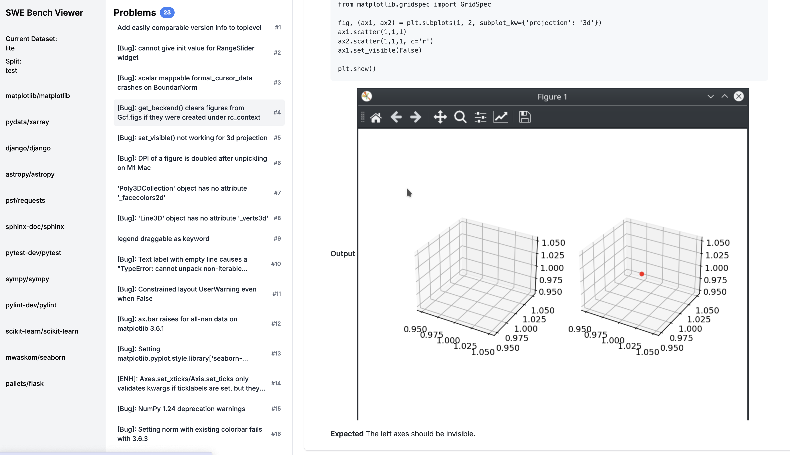

# swe-bench-solver

Help us solve the SWE Bench challenge!


## 1. Viewer

The viewer is a web app that allows you to browse the SWE Bench dataset.

### Run

```bash
cd viewer
make run
```

## 2. SWE Bench Solver

(TBD)

This document outlines our approach to solving the SWE (Software Engineering) Bench challenge.

### Approach

1. **Problem Analysis**
   - Thoroughly review the SWE Bench requirements and constraints
   - Identify key challenges and potential bottlenecks

2. **Design Phase**
   - Develop a high-level architecture for the solution
   - Create detailed design documents for each component

3. **Implementation**
   - Set up the development environment
   - Implement core functionalities incrementally
   - Conduct regular code reviews to maintain quality

4. **Testing**
   - Develop a comprehensive test suite
   - Perform unit testing, integration testing, and system testing
   - Conduct performance testing to ensure efficiency

5. **Optimization**
   - Analyze performance metrics
   - Identify and resolve bottlenecks
   - Refactor code for improved efficiency

6. **Documentation**
   - Create user documentation
   - Write technical documentation for future maintenance

7. **Deployment**
   - Prepare deployment scripts
   - Set up continuous integration and deployment pipelines

8. **Monitoring and Maintenance**
   - Implement logging and monitoring systems
   - Establish a process for bug fixes and updates

By following this structured approach, we aim to develop a robust and efficient solution for the SWE Bench challenge.
